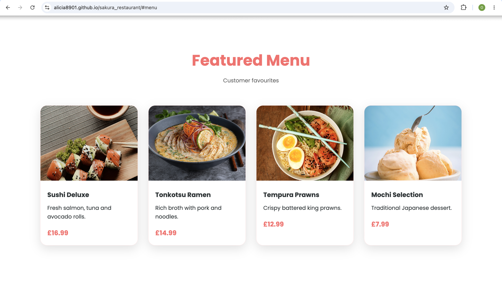
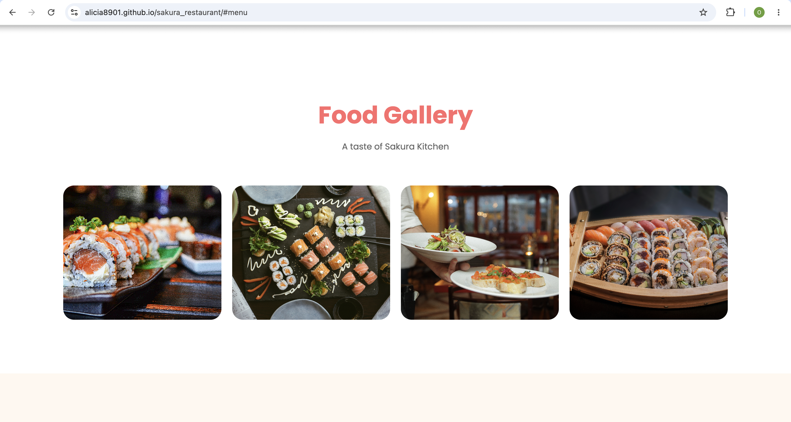

# 🍣 Sakura Kitchen 

A modern, responsive Japanese restaurant website built using HTML, CSS, and JavaScript.

## Live Demo 

https://alicia8901.github.io/sakura_restaurant/

<h2>Screenshots</h2>

<h3>Desktop View</h3>

  

<h3>Key Features</h3>

  
  &nbsp;&nbsp;&nbsp;&nbsp;
  

## Features

* Responsive design for desktop, tablet, and mobile devices
* Modern and visually appealing user interface
* Smooth scrolling navigation
* Interactive menu cards with hover effects
* Food gallery section
* Customer testimonials
* Opening hours section
* Reservation contact form
* Scroll reveal animations

## Technologies Used

* HTML5
* CSS3
* JavaScript (ES6)

## Project Overview

Sakura Kitchen is a fictional Japanese restaurant website created to showcase front-end web development skills. The project focuses on responsive design, user experience, and clean visual presentation while simulating a real-world restaurant business website.

The website includes:

* Hero section
* About section
* Featured menu
* Food gallery
* Customer reviews
* Opening hours
* Contact and reservation form

## Installation

1. Clone the repository:

git clone https://github.com/your-username/sakura_restaurant.git

2. Navigate to the project folder:

cd sakura_restaurant

3. Open index.html in your browser.

## Future Improvements

* Online table booking system
* Interactive menu filtering
* Google Maps integration
* Dark mode
* Enhanced accessibility

## Author

Omoefe Alicia Osayi